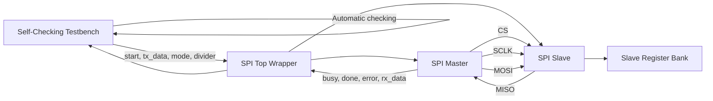
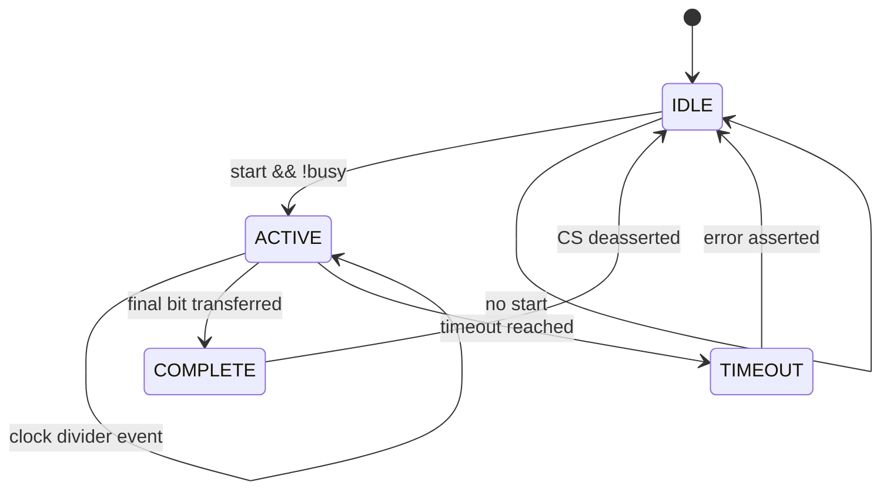
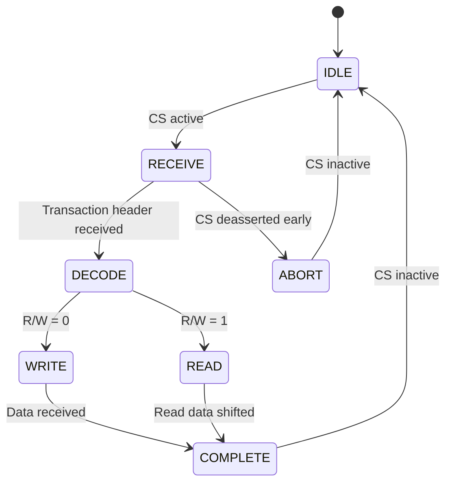

# Configurable SPI Master with Register-Based SPI Slave

## 1. Project Overview

This project implements a configurable **SPI Master** connected to a simple **register-based SPI Slave** through a top-level wrapper. A self-checking Verilog testbench is used to verify the complete master-slave communication path.

The design was developed in **Verilog HDL** and simulated using **Xilinx Vivado 2024.2 / XSim**.

The main objective is to demonstrate a practical SPI controller that supports different SPI timing modes, programmable clock division, selectable transfer width, register-based slave access, error handling, and automatic verification.

### Main Features

- SPI Mode 0, Mode 1, Mode 2, and Mode 3
- Configurable SPI clock divider
- 8-bit and 16-bit transfer support
- Start, Busy, Done, and Error control
- Full-duplex MOSI/MISO communication
- Correct active-low chip-select (`CS`) handling
- Back-to-back transactions
- Start request rejection while the master is busy
- Timeout/error indication
- Register-based SPI slave
- Read-only and read/write registers
- Invalid register handling
- Reset handling during an active transaction
- Early chip-select and incorrect-clock-count checks
- MSB-first data-order verification
- Random transactions with automatic checking
- Self-checking testbench with PASS/FAIL reporting

---

## 2. Assignment Requirements

The implementation follows the required structure of the assignment:

1. Configurable SPI Master
2. Register-based SPI Slave
3. Self-checking testbench connecting the master and slave
4. Verification of all four SPI modes
5. Verification of read/write transactions and corner cases

The required mandatory test cases are included in the verification environment.

---

## 3. Design Architecture

The complete design contains three main RTL blocks and one verification block.



### 3.1 SPI Master

The SPI Master is responsible for:

- Generating the SPI clock.
- Selecting the SPI mode using `spi_mode`.
- Generating the active-low chip-select signal.
- Shifting transmitted data on MOSI.
- Sampling received data from MISO.
- Supporting 8-bit and 16-bit transfers.
- Generating `busy` while a transfer is active.
- Generating `done` when a transfer finishes.
- Generating `error` for invalid operating conditions such as a busy start request or timeout.
- Maintaining the correct clock/data relationship for CPOL and CPHA.

### 3.2 SPI Slave

The SPI Slave acts as a small register device.

It:

- Detects the active-low chip-select.
- Receives the transaction serially on MOSI.
- Decodes the read/write bit.
- Decodes the register address.
- Handles register access.
- Returns read data on MISO.
- Ignores writes to read-only registers.
- Returns a defined value for invalid register reads.
- Detects incomplete or incorrectly sized transactions.

### 3.3 Top-Level Wrapper

`spi_top` connects the master and slave together.

The important SPI connections are:

| Signal | Direction | Function |
|---|---|---|
| `CS` | Master → Slave | Chip select |
| `SCLK` | Master → Slave | SPI clock |
| `MOSI` | Master → Slave | Master-out/slave-in data |
| `MISO` | Slave → Master | Master-in/slave-out data |

The top-level wrapper makes it possible to verify the complete SPI communication path in simulation.


---

## 4. SPI Transaction Format

The slave uses a 16-bit transaction format:

```text
+--------+----------------+----------------+
| Bit 15 | Bits 14:8      | Bits 7:0       |
+--------+----------------+----------------+
| R/W    | Register Addr  | Write/Dummy    |
+--------+----------------+----------------+
```

### Fields

- **Bit 15 — R/W**
  - `0`: Write transaction
  - `1`: Read transaction

- **Bits 14:8 — Register Address**
  - Selects the slave register.

- **Bits 7:0 — Data**
  - Write data for a write transaction.
  - Dummy byte for a read transaction.

For a read transaction, the slave places the requested register value on MISO.

---

## 5. Slave Register Map

| Address | Register | Access | Description |
|---|---|---|---|
| `0x00` | Device ID | RO | Fixed device identification value |
| `0x01` | Control | RW | Software-controlled register |
| `0x02` | Status | RO | Current slave status |
| `0x03` | Data | RW | General-purpose data register |
| Other | Invalid | - | Invalid register access |

The Device ID register is read-only. The Control and Data registers support read/write access. The Status register is read-only.

---

## 6. SPI Modes and Timing

The SPI mode is selected using two bits:

```text
Mode = {CPOL, CPHA}
```

| SPI Mode | CPOL | CPHA | Clock Idle | Sampling Edge | Data Change Edge |
|---|---:|---:|---|---|---|
| Mode 0 | 0 | 0 | Low | Rising | Falling |
| Mode 1 | 0 | 1 | Low | Falling | Rising |
| Mode 2 | 1 | 0 | High | Falling | Rising |
| Mode 3 | 1 | 1 | High | Rising | Falling |

The implementation handles both CPOL and CPHA so that the same master can communicate correctly using all four standard SPI modes.

### Data Order

The design transfers data **MSB first**.

For example, for an 8-bit value:

```text
A5 = 1010_0101

First bit transmitted = 1
Last bit transmitted  = 1
```

The testbench includes a specific MSB-first verification.

---

## 7. Master Transfer Flow

The master can be viewed using the following functional FSM.



### IDLE

- `busy = 0`
- `CS = 1`
- SPI clock remains at the selected CPOL level.
- A new transfer can be accepted.

### ACTIVE

- `busy = 1`
- `CS = 0`
- SPI clock is generated according to the configured divider.
- MOSI data is shifted.
- MISO data is sampled.
- Bit count is updated.

### COMPLETE

- The final transfer bit has been processed.
- Received data is stored in `rx_data`.
- `done` is asserted.
- `CS` returns inactive.

### TIMEOUT

If a transfer does not complete within the permitted timeout interval:

- `error` is asserted.
- `CS` is deasserted.
- The master returns to the idle condition.

> Note: The RTL uses control registers and conditions rather than a separately declared Verilog `state` variable. The diagram above is the functional transfer sequence used to explain the implemented behavior.

---

## 8. Slave Transaction Flow

The slave can be represented by the following functional transaction sequence.



### IDLE

The slave waits for `CS` to become active.

### RECEIVE

The slave receives serial data from MOSI and reconstructs the transaction.

### DECODE

The read/write command and register address are decoded.

### WRITE

For a write transaction:

- Writable registers are updated.
- Read-only registers are protected.
- Invalid addresses are ignored.

### READ

For a read transaction:

- The selected register value is shifted out on MISO.
- Invalid register reads return the defined invalid value.

### COMPLETE / ABORT

The transaction finishes normally when the expected transfer is completed. If `CS` is removed early, the incomplete transaction is discarded or handled as an invalid transaction.

---

## 9. Clock Divider

The SPI clock is derived from the main system clock using a programmable divider.

The divider determines how frequently the master changes the SPI clock level.

Conceptually:

```text
System Clock
     |
     v
Clock Divider
     |
     v
SPI SCLK
```

A larger divider value produces a slower SPI clock.

The testbench checks multiple divider values to verify that changing the divider does not corrupt the transmitted or received data.

---

## 10. Transfer Width

The master supports:

- **8-bit transfer**
- **16-bit transfer**

The `transfer_16` control selects the transfer width.

For 16-bit transfers, the complete 16-bit shift path is used.

For 8-bit transfers, the relevant 8-bit data is transferred while the transaction control remains compatible with the implemented interface.

---

## 11. Control and Status Signals

| Signal | Description |
|---|---|
| `start` | Requests a new SPI transfer |
| `busy` | Indicates that a transfer is currently active |
| `done` | Pulses when a transfer completes |
| `error` | Indicates a transfer/control error |
| `tx_data` | Data provided to the master for transmission |
| `rx_data` | Data received by the master |
| `transfer_16` | Selects 8-bit or 16-bit operation |
| `spi_mode` | Selects SPI mode 0–3 |
| `clk_div` | Configures SPI clock division |
| `CS` | Active-low slave selection |
| `SCLK` | SPI serial clock |
| `MOSI` | Master output data |
| `MISO` | Slave output data |

---

## 12. Verification Strategy

The testbench is **self-checking**. It does not depend only on visual waveform inspection.

For each transaction, the testbench compares the observed result with the expected result and reports either:

```text
PASS ...
```

or

```text
FAIL ...
```

An error counter is maintained throughout the simulation.

The final result is reported as:

```text
TEST PASSED
TOTAL ERRORS = 0
```

This makes the verification reproducible and reduces dependence on manually inspecting waveforms.

---

## 13. Mandatory Test Cases

The assignment requires the following tests. The final simulation includes all of them.

| Test Case | Result |
|---|---|
| All four SPI modes | PASS |
| Read and write transactions | PASS |
| Different clock-divider values | PASS |
| Back-to-back transfers | PASS |
| Reset during a transaction | PASS |
| Start request while busy | PASS |
| Invalid register address | PASS |
| Chip-select deasserted early | PASS |
| Incorrect clock count | PASS |
| Random transactions with automatic checking | PASS |
| MISO/MOSI data order verification | PASS |

### Additional Verification

The testbench also checks:

- 8-bit transfer
- Device ID read
- Status register read
- Write protection of read-only registers
- Invalid register read/write behavior
- MSB-first transmission

---

## 14. Simulation Result

Simulation was performed using:

- **HDL:** Verilog
- **Tool:** Xilinx Vivado 2024.2
- **Simulator:** XSim
- **Simulation top:** `tb_spi`

The final self-checking simulation completed successfully.

```text
============================================
 SPI MASTER / SLAVE TESTBENCH
============================================

MODE 0: PASS
MODE 1: PASS
MODE 2: PASS
MODE 3: PASS

CLOCK DIVIDERS: ALL PASS
8-BIT: PASS
BACK-TO-BACK: ALL PASS
BUSY: PASS
INVALID WRITE/READ: PASS
RO WRITE: PASS
STATUS: PASS
RESET: PASS
EARLY CS: PASS
INCORRECT CLOCK COUNT: PASS
MSB-FIRST: PASS
DEVICE ID: PASS
RANDOM: PASS

============================================
TEST PASSED
TOTAL ERRORS = 0
============================================
```

The complete simulator output is provided separately as:

```text
Simulation/simulation_log.txt
```

---

## 15. Waveform Evidence

Waveforms are provided for all four SPI modes.


Recommended waveform files:

```text
Waveforms/
└── all_modes_waveform.png
```

Each waveform should show the relevant SPI signals, including:

- `spi_mode`
- `CS`
- `SCLK`
- `MOSI`
- `MISO`
- `busy`
- `done`
- `rx_data`

### Mode 0


### Mode 1


### Mode 2


### Mode 3


If the image files are not yet present, the placeholders above can be retained until the final waveform screenshots are added.

---

## 16. Corner Cases

### 16.1 Start While Busy

A new `start` request is not accepted while a transaction is already active.

This prevents the current shift operation from being overwritten.

### 16.2 Back-to-Back Transfers

After a transaction completes, the master returns to the inactive chip-select condition and can accept another transfer.

This allows transactions to occur consecutively without resetting the entire design.

### 16.3 Reset During Transaction

Reset immediately returns the master to its idle condition.

The active transaction is terminated and the SPI interface is returned to a safe inactive state.

### 16.4 Early Chip Select

If `CS` is deasserted before the expected transaction is complete, the transaction is treated as incomplete.

This condition is specifically checked by the testbench.

### 16.5 Incorrect Clock Count

The verification environment checks that an incomplete or incorrect number of SPI clock edges does not produce a false successful transaction.

### 16.6 Invalid Register Address

Only the implemented register addresses are valid.

Invalid register access does not modify the valid registers. Invalid reads return the defined invalid response.

### 16.7 Read-Only Registers

Writes to read-only registers are rejected and do not modify the register contents.

### 16.8 Timeout

A transfer that remains active beyond the timeout limit causes the master to assert `error` and terminate the transaction.

---

## 17. File Structure

The recommended submission structure is:

```text
SPI_Project/
│
├── RTL/
│   ├── spi_master.v
│   ├── spi_slave.v
│   └── spi_top.v
│
├── Testbench/
│   └── tb_spi_test.v
│
├── Waveforms/
│   └── all_modes_waveform.png
│
├── Simulation/
│   └── All simulation_log.txt
│
│
└── README.md
```

The RTL source files and testbench are supplied separately as Verilog source files.

---

## 18. How to Run the Simulation

### Using Vivado

1. Open Vivado.
2. Create or open the SPI project.
3. Add the files from `RTL/` as design sources.
4. Add `tb_spi_test.v` as a simulation source.
5. Set `tb_spi` as the simulation top.
6. Run **Behavioral Simulation**.
7. Allow the testbench to complete.
8. Check the Tcl Console or simulator log.
9. Confirm:

```text
TEST PASSED
TOTAL ERRORS = 0
```

### Important

The testbench is self-checking, so a successful simulation should be judged using the final PASS/FAIL summary rather than only by visually inspecting a waveform.

---

## 19. Synthesis

The RTL is written in synthesizable Verilog style and does not depend on testbench-only constructs inside the design modules.


Suggested report files:

```text
Synthesis/
├── utilization_report.txt
└── timing_report.txt
```
 synthesis is successfully run on a supported device, the report record:

- LUT utilization
- Flip-flop utilization
- I/O utilization
- Timing summary
- Maximum frequency / slack
- Any synthesis warnings

---

## 20. Limitations

The current implementation is intentionally kept simple to satisfy the assignment requirements.

- The design is intended for a single SPI slave connection.
- There is no TX/RX FIFO in the base implementation.
- There is no multi-slave chip-select controller.
- There is no DMA interface.
- The register map is fixed.
- The timeout value is implemented as a fixed design parameter.
- The design does not implement advanced SPI features such as variable frame formats or programmable bit ordering.
- Synthesis results depend on the selected FPGA device and available Vivado license.

The optional TX/RX FIFO mentioned in the assignment is not required for the base implementation and is therefore not included.

---

## 21. Design Verification Summary

The project satisfies the main functional requirements through RTL implementation and self-checking simulation.

```text
+---------------------------------------------+
|        SPI MASTER / SLAVE VERIFICATION      |
+---------------------------------------------+
| SPI Modes 0/1/2/3              | PASS       |
| Read / Write                   | PASS       |
| Clock Divider                  | PASS       |
| 8/16-bit Operation             | PASS       |
| Back-to-Back Transfers         | PASS       |
| Busy Protection                | PASS       |
| Reset During Transfer          | PASS       |
| Invalid Register               | PASS       |
| Early CS                       | PASS       |
| Incorrect Clock Count          | PASS       |
| Random Transactions            | PASS       |
| MSB-First Data Order           | PASS       |
+---------------------------------------------+
| TOTAL ERRORS                  | 0          |
+---------------------------------------------+
```

---

## 22. Conclusion

This project demonstrates a complete configurable SPI communication system consisting of a Verilog SPI Master, a register-based SPI Slave, and a self-checking verification environment.

The master supports all four standard SPI modes, programmable clock division, selectable transfer width, full-duplex communication, busy/done/error handling, and transaction protection. The slave provides a simple register interface with read-only and read/write registers.

The final simulation successfully verifies the required functional cases and reports:

```text
TEST PASSED
TOTAL ERRORS = 0
```

The project can be extended in future with FIFO buffering, multiple SPI slaves, interrupt support, programmable register maps, and higher-level bus interfaces.

